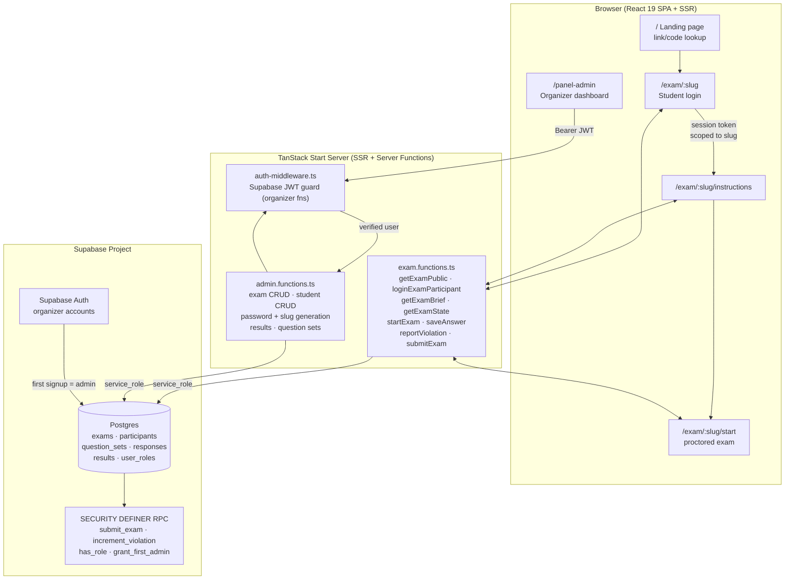
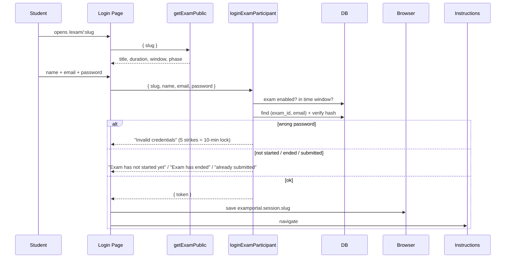
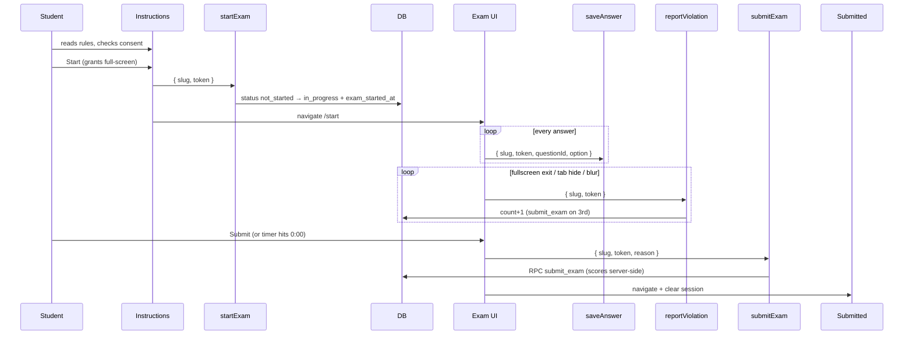

# ExamPortal — Secure, Seamless Online Exams

ExamPortal is a brand-neutral, multi-exam online examination platform.
Each exam lives at its own unique, hard-to-guess URL. Students log in on that
URL with their name, email, and an organizer-generated password, then take a
timed, proctored test that auto-submits. Organizers manage everything —
exams, links, student credentials, question sets, and results — from one
dashboard.

Built with **TanStack Start** (SSR + server functions), **React 19**,
**Tailwind CSS 4**, **shadcn/ui**, and **Supabase** (Postgres + Auth).

---

## Table of Contents

- [Features](#features)
- [Architecture](#architecture)
- [Data Model](#data-model)
- [Routing](#routing)
- [Flows](#flows)
- [Organizer Guide](#organizer-guide)
- [Student Guide](#student-guide)
- [Getting Started](#getting-started)
- [Database Setup](#database-setup)
- [Project Structure](#project-structure)
- [Configuration \& Branding](#configuration--branding)
- [Security](#security)
- [Testing Checklist](#testing-checklist)
- [Troubleshooting](#troubleshooting)
- [Tech Stack](#tech-stack)

---

## Features

| Area | What you get |
| ---- | ------------ |
| Multi-exam links | Every exam gets a unique slug URL (`/exam/<slug>`), copy-link button, enable/disable toggle, link regeneration, optional start/end window |
| Student login | Name + Email + organizer-generated password, scoped to one exam; show/hide password, loading states, friendly errors |
| Credential management | Auto-generated 10-char passwords, shown once; single add, CSV bulk upload, regenerate, credentials-CSV download, pre-filled email drafts |
| Proctored exam | Full-screen enforcement, tab-switch/blur detection, 3-strike auto-submit, live countdown, continuous answer saving, timeout auto-submit |
| Results | Per-exam dashboard (registered/completed/avg score/avg time), sortable participant table, per-student answer sheets, CSV exports, reset/delete |
| Landing page | Marketing-style home with exam-link/code lookup, features, how-it-works, organizer CTA, responsive + dark-mode friendly |
| Branding | Single config file (`src/config/brand.ts`) — rename/re-theme in one place |

---

## Architecture



**Request flow in words:**

1. **Student pages** call exam server functions with `{ slug, ... }`. Every
   lookup joins the participant row to its exam and compares slugs, so a
   session token issued for exam A is rejected inside exam B.
2. **Organizer functions** pass through `requireSupabaseAuth` (validates the
   Supabase JWT from the request) plus an `assertAdmin` role check, then use
   the service-role client to bypass RLS safely on the server.
3. **Scoring and violation counting** run inside Postgres (`submit_exam`,
   `increment_violation`) as atomic, idempotent operations — safe under
   retries, reloads, and double-submit races.
4. **Sessions** are opaque `session_token` UUIDs stored per exam in
   `localStorage` (`examportal.session.<slug>`); passwords never leave the
   server in plain text except at the moment of creation (shown once).

---

## Data Model

```mermaid
erDiagram
    exams ||--o{ participants : "has (exam_id)"
    question_sets ||--o| exams : "linked via question_set_id"
    question_sets ||--o{ participants : "legacy fallback"
    participants ||--o{ responses : "answers"
    participants ||--o| results : "score"

    exams {
        uuid id PK
        text slug UK "hard-to-guess URL part"
        text title
        text description
        int duration_minutes
        numeric marks_correct
        numeric marks_wrong
        timestamptz starts_at "nullable"
        timestamptz ends_at "nullable"
        bool is_enabled
        uuid question_set_id FK "nullable"
    }
    participants {
        uuid id PK
        uuid exam_id FK "nullable (legacy rows)"
        text name
        text email "unique per exam"
        text password_salt
        text password_hash "sha256(salt+password)"
        int failed_attempts
        timestamptz locked_until
        uuid session_token
        text status "not_started|in_progress|completed"
    }
    question_sets {
        uuid id PK
        jsonb data "{meta, questions[]}"
        bool is_active "legacy global set"
    }
    responses {
        uuid id PK
        uuid participant_id FK
        int question_id
        text selected_option "A|B|C|D|null"
    }
    results {
        uuid participant_id PK_FK
        int total_correct
        int total_wrong
        int total_unattempted
        numeric total_marks
    }
```

Key constraints:

- `participants (exam_id, lower(email))` is unique — the same email can take
  many exams, each with its own password.
- `exams.slug` matches `^[a-z0-9]+(-[a-z0-9]+)*$` and is generated as
  `<3 title words>-<10 random chars>`.
- `submit_exam` resolves the question set in order: **exam's set → the
  participant's pinned set → the globally active set** (legacy fallback).

---

## Routing

| URL | Page | Guard |
| --- | ---- | ----- |
| `/` | Landing page: hero, exam-link/code lookup, features, how-it-works, organizer CTA | public |
| `/exam` | "Find your exam" helper (paste link/code) | public |
| `/exam/:slug` | Exam-specific student login (Name + Email + Password, exam details) | redirects to instructions if already logged in |
| `/exam/:slug/instructions` | Rules, marking scheme, consent checkbox, full-screen start | requires that exam's session → else login |
| `/exam/:slug/start` | Proctored exam (timer, palette, violations, auto-submit) | requires session → else login |
| `/exam/:slug/submitted` | Submission confirmation | public (clears that exam's session) |
| `/panel-admin` | Organizer dashboard (Exams / Results / Questions) | Supabase auth + admin role → else login |
| `/panel-admin-login` | Organizer sign-in / first-account signup | public |
| `/organizer` | Alias → redirects to `/panel-admin` | — |
| `/submitted` | Generic confirmation (legacy) | public |
| unknown slug | Friendly "Exam not found / link expired" page | — |

---

## Flows

### Student login (per exam)



### Exam attempt



---

## Organizer Guide

### 1. Create the organizer account

Open `/panel-admin-login` and sign up once. The database trigger
`grant_first_admin` makes the **first-ever** user an admin automatically.

### 2. Create an exam

**Exams tab → New exam.** Enter a title, duration, optional description and
start/end times. The app generates the private link
(`https://<domain>/exam/<slug>`) and copies it to your clipboard.

| Control | Effect |
| ------- | ------ |
| Copy link | One-click copy of the exam URL |
| New link | Regenerates the slug; the old URL stops working |
| Enable / Disable | Disabled links reject logins immediately |
| Start / End time | Logins before start → "not started yet"; after end → "ended" |

### 3. Add students & share credentials

Click **Manage** on an exam, then:

- **Add student** — name + email. A random 10-character password
  (A–Z, a–z, 2–9, no ambiguous chars) is generated and shown **once**.
- **Bulk upload** — paste or attach CSV lines, one per line:
  `Aarav Sharma, aarav@example.com` (header row optional, `;`/tab also work).
- **Download credentials CSV** — `Name, Email, Password, Exam Link`. Download
  immediately: passwords are stored hashed and cannot be recovered later.
- **Email button** — opens a pre-filled `mailto:` draft in your mail client
  (no SMTP is configured server-side; see `adminEmailCredentials` stub).
- **Regenerate** — issues a fresh password for one student (also shown once).

### 4. Attach questions

**Questions tab** → select the exam → paste or upload the question-bank JSON:

```json
{
  "meta": {
    "event": "Physics Midterm 2026",
    "organiser": "ExamPortal",
    "total_questions": 2,
    "marks_correct": 2,
    "marks_wrong": -0.5,
    "max_marks": 4,
    "duration_minutes": 45
  },
  "questions": [
    {
      "id": 1, "topic": "Mechanics",
      "question": "What is Newton's second law?",
      "option_a": "F = m/a", "option_b": "F = ma",
      "option_c": "F = m + a", "option_d": "F = m - a",
      "correct": "B"
    }
  ]
}
```

`total_questions` must equal the array length and `id`s must be unique —
validated server-side before activation.

### 5. Watch results

**Results tab** → pick the exam. Stats, sortable table, per-student answer
sheets, CSV exports, plus **Reset exam** (clears answers/timer/violations) and
**Delete participant**.

---

## Student Guide

1. Open the exam link from your organizer **on a laptop or desktop** (phones
   are blocked — full-screen proctoring needs a desktop browser).
2. Log in with your **name, email, and the password your organizer shared**.
   Passwords work only for your exam.
3. Read the instructions, tick consent, click **Start** and allow full-screen.
4. Answer within the timer. Stay in full-screen — leaving it, switching tabs,
   or opening another app counts as a violation; **three violations submit
   the test automatically**. Reloading is safe (answers persist, clock keeps
   running). At `00:00` the test submits itself.

---

## Getting Started

Requirements: Node.js 20+ (or Bun) and a Supabase project.

```sh
# 1. Install (repo ships bun.lock; npm works too)
bun install        # or: npm i

# 2. Configure — create .env (never commit it)
SUPABASE_URL="https://<project-ref>.supabase.co"
SUPABASE_PUBLISHABLE_KEY="sb_publishable_..."
SUPABASE_SERVICE_ROLE_KEY="eyJ..."        # server only, no VITE_ prefix
VITE_SUPABASE_URL="https://<project-ref>.supabase.co"
VITE_SUPABASE_PUBLISHABLE_KEY="sb_publishable_..."

# 3. Create the schema (see Database Setup below)

# 4. Run
bun run dev        # or: npm run dev  →  http://localhost:8080

# 5. Build / preview
bun run build && bun run preview
```

Find keys in **Supabase Dashboard → Project Settings → API** (publishable +
secret). The legacy `anon` JWT is not used by the app.

---

## Database Setup

Run **`supabase/migrations/20261006000000_multiexam_platform.sql`** in
**Supabase Dashboard → SQL Editor → New query → Run**. On a brand-new project
it is self-contained (drops nothing, creates everything in dependency order).
On the original Lovable-linked database, run the two earlier migration files
first, in filename order.

What it creates:

| Object | Purpose |
| ------ | ------- |
| `exams` | Exam records with slug, window, marks, question-set link |
| `participants` (+`exam_id`, `password_salt/hash`, `failed_attempts`, `locked_until`) | Per-exam student credentials |
| `question_sets`, `responses`, `results`, `user_roles` | Question banks, answers, scores, admin roles |
| `submit_exam()` | Atomic server-side scoring, exam-aware, idempotent |
| `increment_violation()` | Atomic violation counter |
| `grant_first_admin()` + trigger | First signup becomes admin |
| `has_role()` + RLS policies | Admins can read; students touch nothing directly (service-role only via server) |

Verify in **Table Editor** that all six tables exist, then sign up once at
`/panel-admin-login` to become admin.

---

## Project Structure

```
src/
  config/brand.ts                 # app name, logo mark, support email (rebrand here)
  routes/
    index.tsx                     # / landing page
    exam/index.tsx                # /exam link/code helper
    exam/$slug/index.tsx          # /exam/:slug student login
    exam/$slug/instructions.tsx   # instructions + consent + start
    exam/$slug/start.tsx          # proctored exam UI
    exam/$slug/submitted.tsx      # confirmation
    panel-admin.tsx               # organizer dashboard
    panel-admin-login.tsx         # organizer auth
    organizer.tsx                 # /organizer → /panel-admin alias
    submitted.tsx                 # generic confirmation
    __root.tsx                    # shell, meta, 404/error boundaries
  lib/
    exam.functions.ts             # student server functions (exam-scoped)
    admin.functions.ts            # organizer server functions (auth-guarded)
    exam-session.ts               # per-slug localStorage sessions
  components/
    DesktopOnly.tsx               # phone block screen
    ui/                           # shadcn/ui primitives
  integrations/supabase/          # clients, auth middleware, generated types
  styles.css                      # design system (Tailwind 4 theme)
supabase/migrations/              # SQL migrations (see Database Setup)
```

`src/routeTree.gen.ts` is auto-generated by TanStack Router — never edit it.

---

## Configuration & Branding

- **Name/logo/support** → `src/config/brand.ts` (`appName`, `logoMark`,
  `tagline`, `supportEmail`). Default neutral name: **ExamPortal**.
- **Colors/typography** → `src/styles.css` (`@theme` + `:root`/`.dark` oklch
  tokens: `brand`, `stone`, `pale-green`, `coral`, …).
- **Secrets** → environment variables only (`.env`, git-ignored). No
  hardcoded credentials, emails, or domains anywhere in the code.

---

## Security

- Passwords stored as salted SHA-256 (`sha256(salt + password)`, 16-byte hex
  salt per student); plain text exists only in the one-time creation response.
- Generic "Invalid credentials" for unknown email vs. wrong password (no
  account enumeration); timing-safe hash comparison; 5-strikes → 10-minute
  lockout (`failed_attempts`, `locked_until`).
- All student operations re-verify `{ slug, token }` against the participant's
  exam; cross-exam token reuse is rejected server-side.
- Organizer functions require a valid Supabase JWT **and** the `admin` role;
  RLS denies students direct table access; scoring runs in `SECURITY DEFINER`
  RPCs granted to `service_role` only.
- Full-screen + visibility/blur enforcement with server-counted violations;
  timeouts enforced server-side on every state read (client clock is display
  only).

---

## Testing Checklist

1. Organizer login → **Exams → New exam** → link auto-copied.
2. **Manage** → add a student → note the one-time password → download CSV.
3. **Questions** → upload the sample JSON above (adjust counts).
4. Incognito → open exam link → log in → instructions → Start (allow
   full-screen) → answer → Submit.
5. Results tab → score appears → export CSV.
6. Negative cases: wrong password ×5 (lockout), exam-A password on exam-B
   link (rejected), disabled link, pre-start link, bogus slug (not-found
   page), `/organizer` redirect.

---

## Troubleshooting

| Symptom | Cause / Fix |
| ------- | ----------- |
| "Missing Supabase environment variable(s)" | `.env` incomplete or dev server started before `.env` existed — fill all 5 vars, restart `bun run dev` |
| "Exam not found" on a fresh link | Slug typo, regenerated link, or migration not applied on that project |
| Login fails for a valid student | Wrong exam link (credentials are per-exam), or account locked after 5 attempts (wait 10 min or regenerate) |
| Organizer dashboard says "Forbidden" | That Supabase user lacks the `admin` role — first signup owns it; check `user_roles` table |
| Scores are 0 / questions missing | Exam has no question set linked — upload one under Questions |
| `tsc` errors after pulling | Run `bun install` (deps drift), don't hand-edit `routeTree.gen.ts` |

---

## Tech Stack

TanStack Start · TanStack Router (file-based) · TanStack Query · React 19 ·
Tailwind CSS 4 · shadcn/ui (Radix) · Supabase Postgres + Auth · Zod · Vite 8 ·
Bun/npm. No extra auth/crypto libraries — hashing uses Node `crypto`.
