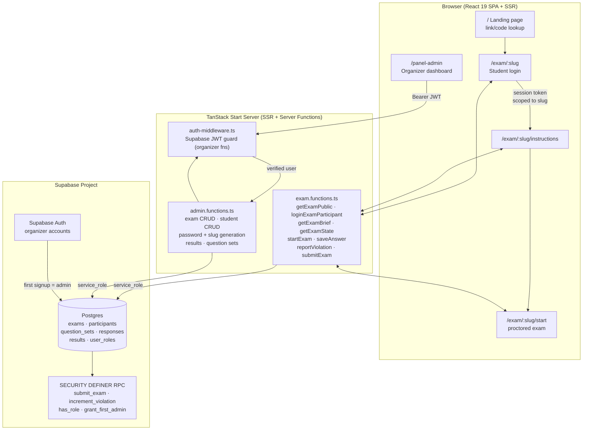
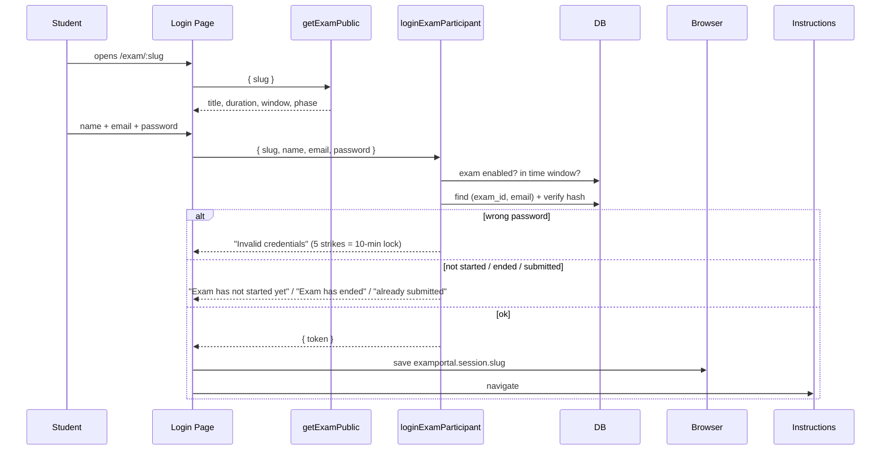
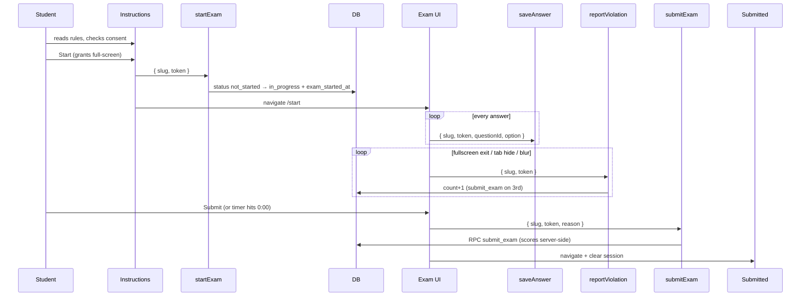

<div align="center">


# ExamPortal

### Secure, Seamless Online Exams

A brand-neutral, multi-exam online examination platform — every exam lives at
its own hard-to-guess URL, students authenticate with organizer-issued
credentials, and everything from proctoring to scoring is enforced
server-side.


[**Features**](#features) ·
[**Architecture**](#architecture) ·
[**API Reference**](#api-reference) ·
[**Getting Started**](#getting-started) ·
[**Organizer Guide**](#organizer-guide) ·
[**Student Guide**](#student-guide) ·
[**FAQ**](#faq)

</div>

---

## Table of Contents

- [Overview](#overview)
- [Features](#features)
- [Architecture](#architecture)
- [Data Model](#data-model)
- [Routing](#routing)
- [API Reference](#api-reference)
- [Flows](#flows)
- [Organizer Guide](#organizer-guide)
- [Student Guide](#student-guide)
- [Getting Started](#getting-started)
- [Database Setup](#database-setup)
- [Project Structure](#project-structure)
- [Configuration \& Branding](#configuration--branding)
- [Security](#security)
- [FAQ](#faq)
- [Testing Checklist](#testing-checklist)
- [Troubleshooting](#troubleshooting)
- [Tech Stack](#tech-stack)
- [Contributing](#contributing)

---

## Overview

**ExamPortal** removes the three pain points of running an online test:

| Pain point | How ExamPortal solves it |
| ---------- | ------------------------ |
| Shared/open links get forwarded to anyone | Each exam gets a private, hard-to-guess slug URL (`/exam/<slug>`) with enable/disable, regeneration, and an optional start/end window |
| One password for the whole class, impossible to audit | Per-student credentials — name + email + an auto-generated 10-char password, hashed with a unique salt, scoped to exactly one exam |
| Answers lost, timers gamed, tabs switched | Server-authoritative clock, continuous answer persistence, and 3-strike full-screen proctoring with auto-submit |

Organizers run everything — exams, links, rosters, question sets, results —
from a single guarded dashboard. Students need nothing but the link and their
credentials.

Built with **TanStack Start** (SSR + server functions), **React 19**,
**Tailwind CSS 4**, **shadcn/ui**, and **Supabase** (Postgres + Auth).

## Features

### For organizers

| Area | What you get |
| ---- | ------------ |
| **Multi-exam links** | Every exam gets a unique slug URL (`/exam/<slug>`), a copy-link button, an enable/disable toggle, link regeneration, and an optional start/end window |
| **Credential management** | Auto-generated 10-char passwords (A–Z, a–z, 2–9, no ambiguous characters) shown once; single add, CSV bulk upload, regenerate, credentials-CSV download, and pre-filled email drafts |
| **Question banks** | Upload a validated question-bank JSON per exam (or a global active set), with server-side checks for count mismatches and duplicate IDs |
| **Results dashboard** | Per-exam stats (registered / completed / avg score / avg time), sortable participant table, per-student answer sheets, CSV exports, reset and delete actions |
| **Branding** | A single config file (`src/config/brand.ts`) — rename and re-theme the whole product in one place |

### For students

| Area | What you get |
| ---- | ------------ |
| **Simple login** | Name + email + organizer-generated password, scoped to one exam; show/hide password, loading states, friendly errors |
| **Proctored exam** | Full-screen enforcement, tab-switch/blur detection, 3-strike auto-submit, live countdown, continuous answer saving, timeout auto-submit |
| **Resume-safe** | Reload the page mid-exam and your answers, timer, and violation count are all restored from the server |
| **Results** | Instant confirmation screen after submission — no more “did it send?” anxiety |

### Platform

- 🏠 **Landing page** — marketing-style home with exam-link/code lookup,
  features, how-it-works, and an organizer CTA; responsive and dark-mode
  friendly
- 📱 **Desktop-first** — phones are blocked with a friendly notice (full-screen
  proctoring needs a desktop browser)
- 🔌 **Zero-config local dev** — one `.env`, one SQL migration, one command

## Architecture



**Request flow in words:**

1. **Student pages** call exam server functions with `{ slug, ... }`. Every
   lookup joins the participant row to its exam and compares slugs, so a
   session token issued for exam A is rejected inside exam B.
2. **Organizer functions** pass through `requireSupabaseAuth` (validates the
   Supabase JWT from the request) plus an `assertAdmin` role check, then use
   the service-role client to bypass RLS safely on the server.
3. **Scoring and violation counting** run inside Postgres (`submit_exam`,
   `increment_violation`) as atomic, idempotent operations — safe under
   retries, reloads, and double-submit races.
4. **Sessions** are opaque `session_token` UUIDs stored per exam in
   `localStorage` (`examportal.session.<slug>`); passwords never leave the
   server in plain text except at the moment of creation (shown once).

> [!NOTE]
> The client clock is **display only**. The server computes the remaining time
> from `exam_started_at` and enforces the timeout on every state read, so
> freezing DevTools or changing the system clock buys a student nothing.

## Data Model

```mermaid
erDiagram
    exams ||--o{ participants : "has (exam_id)"
    question_sets ||--o| exams : "linked via question_set_id"
    question_sets ||--o{ participants : "legacy fallback"
    participants ||--o{ responses : "answers"
    participants ||--o| results : "score"

    exams {
        uuid id PK
        text slug UK "hard-to-guess URL part"
        text title
        text description
        int duration_minutes
        numeric marks_correct
        numeric marks_wrong
        timestamptz starts_at "nullable"
        timestamptz ends_at "nullable"
        bool is_enabled
        uuid question_set_id FK "nullable"
    }
    participants {
        uuid id PK
        uuid exam_id FK "nullable (legacy rows)"
        text name
        text email "unique per exam"
        text password_salt
        text password_hash "sha256(salt+password)"
        int failed_attempts
        timestamptz locked_until
        uuid session_token
        text status "not_started|in_progress|completed"
    }
    question_sets {
        uuid id PK
        jsonb data "{meta, questions[]}"
        bool is_active "legacy global set"
    }
    responses {
        uuid id PK
        uuid participant_id FK
        int question_id
        text selected_option "A|B|C|D|null"
    }
    results {
        uuid participant_id PK_FK
        int total_correct
        int total_wrong
        int total_unattempted
        numeric total_marks
    }
```

**Key constraints:**

- `participants (exam_id, lower(email))` is unique — the same email can take
  many exams, each with its own password.
- `exams.slug` matches `^[a-z0-9]+(-[a-z0-9]+)*$` and is generated as
  `<3 title words>-<10 random chars>`.
- `submit_exam` resolves the question set in order: **exam's set → the
  participant's pinned set → the globally active set** (legacy fallback).
- Scoring columns (`total_correct`, `total_wrong`, `total_marks`, …) are
  written only by the `submit_exam` RPC — never by client-side code.

---

## Routing

| URL | Page | Guard |
| --- | ---- | ----- |
| `/` | Landing page: hero, exam-link/code lookup, features, how-it-works, organizer CTA | public |
| `/exam` | “Find your exam” helper (paste link/code) | public |
| `/exam/:slug` | Exam-specific student login (Name + Email + Password, exam details) | redirects to instructions if already logged in |
| `/exam/:slug/instructions` | Rules, marking scheme, consent checkbox, full-screen start | requires that exam's session → else login |
| `/exam/:slug/start` | Proctored exam (timer, palette, violations, auto-submit) | requires session → else login |
| `/exam/:slug/submitted` | Submission confirmation | public (clears that exam's session) |
| `/panel-admin` | Organizer dashboard (Exams / Results / Questions) | Supabase auth + admin role → else login |
| `/panel-admin-login` | Organizer sign-in / first-account signup | public |
| `/organizer` | Alias → redirects to `/panel-admin` | — |
| `/submitted` | Generic confirmation (legacy) | public |
| unknown slug | Friendly “Exam not found / link expired” page | — |

## API Reference

All endpoints are **TanStack Start server functions** invoked over POST —
inputs are Zod-validated, and organizer functions pass through JWT + role
middleware before any handler code runs.

### Student functions — `src/lib/exam.functions.ts`

| Function | Input | Returns | Notes |
| -------- | ----- | ------- | ----- |
| `getExamPublic` | `{ slug }` | Public exam card: title, description, duration, marks, window, `phase` | `slug` accepts a bare slug **or** a full pasted URL; throws `EXAM_NOT_FOUND` on bad links |
| `loginExamParticipant` | `{ slug, name, email, password }` | `{ token, name }` | Checks enablement and time window first, then the salted hash; refreshes the stored display name; 5 failures → 10-minute lockout |
| `getExamBrief` | `{ slug, token }` | `{ name, status, meta, phase }` | Instructions page payload — **never includes questions** |
| `getExamState` | `{ slug, token }` | `{ name, status, examStartedAt, violations, serverNow, meta, examTitle, questions, answers }` | Server computes elapsed time; auto-submits with reason `timeout` when the duration is exceeded; returns no questions once completed |
| `startExam` | `{ slug, token }` | `{ ok }` | `not_started → in_progress`, stamps `exam_started_at` |
| `saveAnswer` | `{ slug, token, questionId, option }` | `{ saved }` | Upserts on `(participant_id, question_id)`; silently returns `saved: false` if the token/slug pair doesn't match |
| `reportViolation` | `{ slug, token }` | `{ count, submitted }` | Calls the `increment_violation` RPC; on the 3rd violation auto-submits with reason `violation` |
| `submitExam` | `{ slug, token, reason: "manual" \| "timeout" }` | `{ submitted }` | Runs the idempotent `submit_exam` RPC; re-submitting an already-completed attempt returns success without side effects |

**Student error codes:**

| Code / message | Meaning |
| -------------- | ------- |
| `EXAM_NOT_FOUND` | Slug doesn't exist (typo, regenerated link, migration not applied) |
| `NOT_AUTHENTICATED` | Token missing, unknown, or issued for a different exam → client clears the session and redirects to login |
| `Invalid credentials.` | Unknown email **or** wrong password — identical by design (no account enumeration) |
| `Too many failed attempts…` | 5 wrong passwords → `locked_until = now + 10 min` |
| `Exam has not started yet.` / `Exam has ended.` / `This exam link is no longer active.` | Outside the start/end window, or the organizer disabled the link |
| `You have already submitted this exam.` | Attempt is already `completed` |

### Organizer functions — `src/lib/admin.functions.ts`

Every function below runs `.middleware([requireSupabaseAuth])` **and** an
in-handler `assertAdmin` role check, then queries through the service-role
client.

| Group | Functions |
| ----- | --------- |
| Exams | `adminListExams` · `adminCreateExam` · `adminUpdateExam` · `adminRegenerateSlug` |
| Students | `adminListStudents` · `adminAddStudent` · `adminBulkAddStudents` · `adminRegenerateStudentPassword` · `adminEmailCredentials` |
| Results | `adminDashboard` · `adminParticipantDetail` · `adminResetParticipant` · `adminDeleteParticipant` |
| Questions | `adminGetQuestionSet` · `adminUploadQuestionSet` · `adminUpdateMeta` |

> [!TIP]
> `adminUploadQuestionSet` validates the JSON against a strict Zod schema
> before touching the database: `total_questions` must equal the array length,
> question `id`s must be unique, and `correct` must be `A`–`D`. The upload is
> rejected with a human-readable message otherwise.

---

## Flows

### Student login (per exam)



### Exam attempt



---

## Organizer Guide

### 1. Create the organizer account

Open `/panel-admin-login` and sign up once. The database trigger
`grant_first_admin` makes the **first-ever** user an admin automatically.

### 2. Create an exam

**Exams tab → New exam.** Enter a title, duration, optional description and
start/end times. The app generates the private link
(`https://<domain>/exam/<slug>`) and copies it to your clipboard.

| Control | Effect |
| ------- | ------ |
| Copy link | One-click copy of the exam URL |
| New link | Regenerates the slug; the old URL stops working immediately |
| Enable / Disable | Disabled links reject logins immediately |
| Start / End time | Logins before start → “not started yet”; after end → “ended” |

### 3. Add students & share credentials

Click **Manage** on an exam, then:

- **Add student** — name + email. A random 10-character password
  (A–Z, a–z, 2–9, no ambiguous chars) is generated and shown **once**.
- **Bulk upload** — paste or attach CSV lines, one per line:
  `Aarav Sharma, aarav@example.com` (header row optional, `;`/tab also work).
- **Download credentials CSV** — `Name, Email, Password, Exam Link`. Download
  it **immediately**: passwords are stored hashed and cannot be recovered
  later.
- **Email button** — opens a pre-filled `mailto:` draft in your mail client
  (no SMTP is configured server-side; see the `adminEmailCredentials` stub).
- **Regenerate** — issues a fresh password for one student (also shown once).

> [!WARNING]
> Anyone with the exam link **plus** a student's credentials can take that
> student's attempt. Share links over a private channel, and regenerate a
> password if you suspect it leaked.

### 4. Attach questions

**Questions tab** → select the exam → paste or upload the question-bank JSON:

```json
{
  "meta": {
    "event": "Physics Midterm 2026",
    "organiser": "ExamPortal",
    "total_questions": 1,
    "marks_correct": 2,
    "marks_wrong": -0.5,
    "max_marks": 2,
    "duration_minutes": 45
  },
  "questions": [
    {
      "id": 1,
      "topic": "Mechanics",
      "question": "What is Newton's second law?",
      "option_a": "F = m/a",
      "option_b": "F = ma",
      "option_c": "F = m + a",
      "option_d": "F = m - a",
      "correct": "B"
    }
  ]
}
```

`total_questions` must equal the array length and `id`s must be unique —
validated server-side before activation.

### 5. Watch results

**Results tab** → pick the exam. Stats, sortable table, per-student answer
sheets, CSV exports, plus **Reset exam** (clears answers/timer/violations) and
**Delete participant**.

---

## Student Guide

1. Open the exam link from your organizer **on a laptop or desktop** (phones
   are blocked — full-screen proctoring needs a desktop browser).
2. Log in with your **name, email, and the password your organizer shared**.
   Passwords work only for your exam.
3. Read the instructions, tick consent, click **Start** and allow full-screen.
4. Answer within the timer. Stay in full-screen — leaving it, switching tabs,
   or opening another app counts as a violation; **three violations submit
   the test automatically**. Reloading is safe (answers persist, clock keeps
   running). At `00:00` the test submits itself.

---

## Getting Started

### Prerequisites

- **Node.js 20+** or **[Bun](https://bun.sh)** (the repo ships `bun.lock`;
  npm works too)
- A free **[Supabase](https://supabase.com)** project
- A desktop browser for testing the proctored exam flow

### 1. Install

```sh
git clone https://github.com/ayushjha-dev/Prarambh.git
cd Prarambh
bun install        # or: npm i
```

### 2. Configure environment

```sh
cp .env.example .env
```

Then fill in all five variables:

| Variable | Scope | Description |
| -------- | ----- | ----------- |
| `SUPABASE_URL` | server | Supabase project URL |
| `SUPABASE_PUBLISHABLE_KEY` | server | Publishable (client-safe) key |
| `SUPABASE_SERVICE_ROLE_KEY` | **server only** — no `VITE_` prefix | Service-role key; must never reach the browser bundle |
| `VITE_SUPABASE_URL` | browser | Same project URL, injected into the client |
| `VITE_SUPABASE_PUBLISHABLE_KEY` | browser | Publishable key for the browser client |

Find the values in **Supabase Dashboard → Project Settings → API**
(publishable + secret/service-role keys). The legacy `anon` JWT is not used by
the app.

> [!IMPORTANT]
> `.env` is git-ignored — never commit real values. Only `VITE_`-prefixed
> variables are exposed to the client; keep the service-role key server-side.

### 3. Create the schema

Run the migration described in [Database Setup](#database-setup) below.

### 4. Run

```sh
bun run dev        # or: npm run dev  →  http://localhost:8080
```

### 5. Build & preview

```sh
bun run build && bun run preview
```

### Available scripts

| Script | Command | Purpose |
| ------ | ------- | ------- |
| `dev` | `vite dev` | Start the dev server with HMR |
| `build` | `vite build` | Production build |
| `build:dev` | `vite build --mode development` | Development-mode build |
| `preview` | `vite preview` | Serve the production build locally |
| `lint` | `eslint .` | Lint the whole repo |
| `format` | `prettier --write .` | Format all files with Prettier |

---

## Database Setup

Run **`supabase/migrations/20261006000000_multiexam_platform.sql`** in
**Supabase Dashboard → SQL Editor → New query → Run**. On a brand-new project
it is self-contained (drops nothing, creates everything in dependency order).
On the original Lovable-linked database, run the two earlier migration files
first, in filename order.

What it creates:

| Object | Purpose |
| ------ | ------- |
| `exams` | Exam records with slug, window, marks, question-set link |
| `participants` (+ `exam_id`, `password_salt/hash`, `failed_attempts`, `locked_until`) | Per-exam student credentials |
| `question_sets`, `responses`, `results`, `user_roles` | Question banks, answers, scores, admin roles |
| `submit_exam()` | Atomic server-side scoring, exam-aware, idempotent |
| `increment_violation()` | Atomic violation counter |
| `grant_first_admin()` + trigger | First signup becomes admin |
| `has_role()` + RLS policies | Admins can read; students touch nothing directly (service-role only via server) |

Verify in **Table Editor** that all six tables exist, then sign up once at
`/panel-admin-login` to become admin.

> [!TIP]
> Prefer the CLI? `supabase db push` also works if you've linked the project
> with `supabase link` — just make sure the migration files run in filename
> order.

---

## Project Structure

```
src/
  config/brand.ts                 # app name, logo mark, support email (rebrand here)
  routes/
    index.tsx                     # / landing page
    exam/index.tsx                # /exam link/code helper
    exam/$slug/index.tsx          # /exam/:slug student login
    exam/$slug/instructions.tsx   # instructions + consent + start
    exam/$slug/start.tsx          # proctored exam UI
    exam/$slug/submitted.tsx      # confirmation
    panel-admin.tsx               # organizer dashboard
    panel-admin-login.tsx         # organizer auth
    organizer.tsx                 # /organizer → /panel-admin alias
    submitted.tsx                 # generic confirmation
    __root.tsx                    # shell, meta, 404/error boundaries
  lib/
    exam.functions.ts             # student server functions (exam-scoped)
    admin.functions.ts            # organizer server functions (auth-guarded)
    exam-session.ts               # per-slug localStorage sessions
  components/
    DesktopOnly.tsx               # phone block screen
    ui/                           # shadcn/ui primitives
  integrations/supabase/          # clients, auth middleware, generated types
  styles.css                      # design system (Tailwind 4 theme)
supabase/migrations/              # SQL migrations (see Database Setup)
```

`src/routeTree.gen.ts` is auto-generated by TanStack Router — never edit it.

---

## Configuration & Branding

| What | Where |
| ---- | ----- |
| Name, logo mark, tagline, support email | `src/config/brand.ts` (`appName`, `logoMark`, `tagline`, `supportEmail`) — default neutral name: **ExamPortal** |
| Colors & typography | `src/styles.css` (`@theme` + `:root`/`.dark` oklch tokens: `brand`, `stone`, `pale-green`, `coral`, …) |
| Secrets | Environment variables only (`.env`, git-ignored) |

No hardcoded credentials, emails, or domains exist anywhere in the code — a
full rebrand is a one-file edit plus a palette swap.

---

## Security

- Passwords stored as **salted SHA-256** (`sha256(salt + password)`, 16-byte
  hex salt per student); plain text exists only in the one-time creation
  response.
- Generic **“Invalid credentials”** for unknown email vs. wrong password (no
  account enumeration); **timing-safe** hash comparison; **5 strikes →
  10-minute lockout** (`failed_attempts`, `locked_until`).
- All student operations re-verify `{ slug, token }` against the participant's
  exam — cross-exam token reuse is rejected server-side.
- Organizer functions require a valid **Supabase JWT** *and* the `admin` role;
  **RLS** denies students direct table access; scoring runs in
  `SECURITY DEFINER` RPCs granted to `service_role` only.
- Full-screen + visibility/blur enforcement with **server-counted
  violations**; timeouts enforced server-side on every state read (the client
  clock is display only).

---

## FAQ

**Can students take the exam on a phone?**
No. Phones are blocked by `DesktopOnly.tsx` — full-screen proctoring requires
a desktop browser. Tablets in landscape may work but aren't the tested target.

**What stops a student from Googling answers?**
Full-screen enforcement plus tab-switch/blur detection: each violation is
counted on the server, and the third one auto-submits the exam. Organizers can
also see the violation count in results.

**Are questions sent to the browser before the exam starts?**
No. `getExamBrief` (instructions page) returns metadata only — questions,
options, and answers arrive solely from `getExamState` after `startExam`, and
`correct` options are stripped from the payload entirely.

**Can one student's password open a different exam?**
No. Credentials are scoped to `participants.exam_id`, and every request
re-verifies `{ slug, token }` against the participant's exam — a token from
exam A is rejected inside exam B.

**What happens if a student refreshes or loses connection?**
Every answer is upserted to `responses` as it's chosen, so a reload restores
answers, remaining time (computed server-side from `exam_started_at`), and the
violation count. A drop after the timer expires still results in a timeout
auto-submit on the next state read.

**I lost a student's password — can it be recovered?**
No. Only `sha256(salt + password)` is stored. Use **Regenerate** to issue a
fresh one (shown once), or download the credentials CSV right after creating
students.

**How do I rebrand this as my own product?**
Edit `src/config/brand.ts` (name, tagline, logo mark, support email) and
adjust the oklch tokens in `src/styles.css`. Nothing else references the name.

**How do I add another admin?**
RLS lets existing admins read `user_roles`, but role assignment is managed in
the database — insert a row with `role = 'admin'` for the target user's id in
the Supabase table editor. (The first-ever signup is granted admin
automatically by the `grant_first_admin` trigger.)

---

## Testing Checklist

1. Organizer login → **Exams → New exam** → link auto-copied.
2. **Manage** → add a student → note the one-time password → download CSV.
3. **Questions** → upload the sample JSON above (adjust counts).
4. Incognito → open exam link → log in → instructions → Start (allow
   full-screen) → answer → Submit.
5. Results tab → score appears → export CSV.
6. Negative cases: wrong password ×5 (lockout), exam-A password on exam-B
   link (rejected), disabled link, pre-start link, bogus slug (not-found
   page), `/organizer` redirect.

---

## Troubleshooting

| Symptom | Cause / Fix |
| ------- | ----------- |
| “Missing Supabase environment variable(s)” | `.env` incomplete or dev server started before `.env` existed — fill all 5 vars, restart `bun run dev` |
| “Exam not found” on a fresh link | Slug typo, regenerated link, or migration not applied on that project |
| Login fails for a valid student | Wrong exam link (credentials are per-exam), or account locked after 5 attempts (wait 10 min or regenerate) |
| Organizer dashboard says “Forbidden” | That Supabase user lacks the `admin` role — first signup owns it; check the `user_roles` table |
| Scores are 0 / questions missing | Exam has no question set linked — upload one under Questions |
| `tsc` errors after pulling | Run `bun install` (deps drift), don't hand-edit `routeTree.gen.ts` |

---

## Tech Stack

| Layer | Choice |
| ----- | ------ |
| Framework | [TanStack Start](https://tanstack.com/start) (SSR + server functions) |
| Routing / data | [TanStack Router](https://tanstack.com/router) (file-based) · [TanStack Query](https://tanstack.com/query) |
| UI | [React 19](https://react.dev) · [Tailwind CSS 4](https://tailwindcss.com) · [shadcn/ui](https://ui.shadcn.com) (Radix) · lucide-react · recharts |
| Backend | [Supabase](https://supabase.com) — Postgres + Auth + RLS + `SECURITY DEFINER` RPCs |
| Validation | [Zod](https://zod.dev) on every server-function input |
| Build | [Vite 8](https://vite.dev) · TypeScript 5.8 · ESLint 9 · Prettier |
| Runtime | Bun (lockfile ships) or Node.js 20+ / npm |
| Crypto | Node built-in `crypto` only — no extra auth/crypto libraries |

---

## Contributing

1. Create a feature branch from `main`.
2. Follow the existing conventions — file-based routes live in
   `src/routes/` (see `src/routes/README.md`); never create `src/pages/` or
   hand-edit `src/routeTree.gen.ts`.
3. Run `bun run lint` and `bun run format` before committing.
4. Keep `.env` out of commits; the repo ships a `bunfig.toml` supply-chain
   guard (`minimumReleaseAge = 86400`) that skips packages published within
   the last 24 hours.

> [!IMPORTANT]
> This project is connected to [Lovable](https://lovable.dev). Avoid
> rewriting published git history — force pushing, or rebasing/amending/
> squashing commits that are already pushed — as it rewrites history on
> Lovable's side and the user will likely lose their project history.
> Commits you push to the connected branch sync back to Lovable and show up
> in the editor, so keep the branch in a working state.

---

<div align="center">

**ExamPortal** — secure, seamless online exams

[Features](#features) · [Architecture](#architecture) · [API Reference](#api-reference) · [Getting Started](#getting-started) · [FAQ](#faq)

<sub>Built with TanStack Start, React 19, Tailwind CSS, and Supabase.</sub>

</div>


